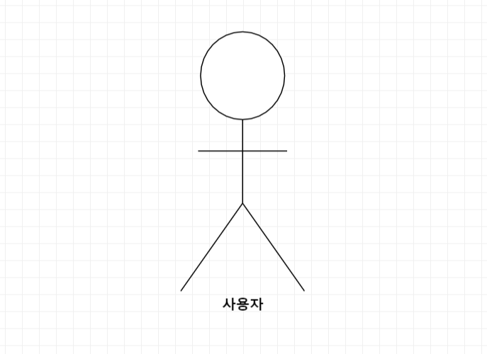

# 2. 사용자 분석

## 2.1. 액터 정의
시스템을 사용하는 사용자 또는 시스템의 외부에 존재하는 시스템을 기술한다. 모든 액터를 기술한다. 2.2 액터 다이어그램의 액터들을 분류한 것과 일치해야 한다.

| 액터 | 설명 |
| --- | --- |
| 사용자 | 할 일 목록 어플리케이션을 사용하는 사용자 |

## 2.2. 액터 다이어그램
위에서 정의한 액터들의 관계를 다이어그림 형태로 작성한다. 최상위 액터부터 사용자를 분류한다.  
