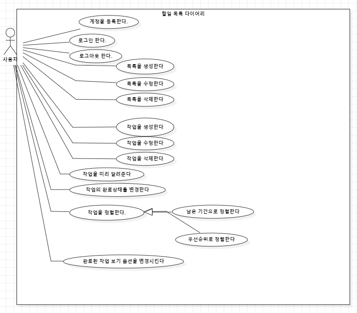

# 3.2 & 3.3. 요구사항 분석: 유스케이스
시스템이 제공하는 기능을 나열한다. 고유 ID를 부여하고, 개발 우선 순위를 고려한다.
Tip1: 개발 우선 순위는 팀 내에서 판단한다. 쉬운 기능 순으로 개발 할 지? 어려운 기능 순으로 개발 할 지? 위험 요소가 많은 기능 순으로 개발 할 지? 등을 고려해 본다.

**우선순위=1**
---

## 목록을 생성한다
### 설명
사용자가 목록을 생성한다.
### 관련 액터
사용자
### 사전 조건
없음
### 사후 조건
사용자는 새로운 목록을 획득한다.
### 기본 흐름
- B1. 사용자는 목록을 생성하는 버튼을 클릭한다.
- B2. 시스템은 사용자에게 목록을 제공한다.
### 대안 흐름
- A1. 사용자가 생성을 취소한다.
### 예외 흐름
- E1. 시스템이 사용자에게 목록을 제공할 수 없을때 (목록 수 제한 등) 오류 메세지를 출력한다.
### 시나리오
- SN1. B1, B2
- SN2. B1, A1
- SN3. B1, E1

## 목록을 수정한다
### 설명
사용자가 목록을 수정한다.
### 관련 액터
사용자
### 사전 조건
사용자가 수정할 대상 목록이 선택되어있어야 한다.
### 사후 조건
사용자가 원하는 대로 목록이 수정된다.
### 기본 흐름
- B1. 사용자는 목록을 수정하는 버튼을 클릭한다.
- B2. 시스템은 목록의 원소 중에 수정될 수 있는 부분을 표시한다.
- B3. 사용자는 변경할 내용을 입력한 후, 확인 버튼을 누른다.
- B4. 시스템은 변경사항을 적용한다.
### 대안흐름
- A1. 사용자가 수정을 취소한다.
### 예외흐름
- E1. 변경사항 중 받아들일 수 없는 내용이 있다면 시스템을 오류 메세지를 출력한다.
### 시나리오
- SN1. B1, B2, B3, B4
- SN2. B1, B2, A1
- SN3. B1, B2, B3, E1

## 목록을 삭제한다
### 설명
사용자가 목록을 삭제한다
### 관련 액터
사용자
### 사전 조건
사용자에게 삭제할 목록이 있어야 한다. 없다면 삭제작업을 실행시킬 버튼이 존재하지 않는다.
### 사후 조건
대상 목록이 삭제된다.
### 기본 흐름
- B1. 사용자는 목록 안에 있는 삭제버튼을 클릭한다.
- B2. 시스템은 확인 메세지를 표시한다.
- B3. 사용자는 확인 버튼을 클릭한다.
- B2. 시스템은 대상 목록을 삭제한다.
### 대안 흐름
- A1. 사용자가 삭제를 취소한다.
### 예외 흐름
### 시나리오
- SN1. B1, B2, B3, B4
- SN2. B1, B2, A1

## 작업을 생성한다
### 설명
사용자가 목록 아래에 작업을 생성한다.
### 관련 액터
사용자
### 사전 조건
사용자에게 대상 목록이 있어야 한다.
### 사후 조건
대상 목록 아래에 작업이 생성된다.
### 기본 흐름
- B1. 사용자가 목록에 있는 작업생성 버튼을 클릭한다.
- B2. 시스템은 목록의 원소를 입력받는 창을 보여준다.
- B3. 사용자가 목록의 원소들을 입력한다.
- B4. 사용자가 완료 버튼을 입력한다.
- B5. 시스템은 내용을 받아들여 새 작업을 생성한다.
### 대안 흐름
- B1. 사용자가 생성을 취소한다.
### 예외 흐름
- E1. 사용자가 입력한 내용이 올바르지 않은 경우, 시스템은 오류 메세지를 출력한다.
- E2. 시스템이 새로운 작업을 생성하는데 실패하는 경우, 시스템은 오류 메세지를 출력한다.
### 시나리오
- SN1. B1, B2, B3, B4, B5
- SN2. B1, B2, B3, B4, E1
- SN3. B1, B2, B3, B4, E2

## 작업을 수정한다
### 설명
사용자가 이미 있는 작업을 수정한다.
### 관련 액터
사용자
### 사전 조건
대상 작업이 존재해야 한다.
### 사후 조건
대상 작업의 내용이 수정된다.
### 기본 흐름
- B1. 사용자가 작업의 수정버튼을 누른다.
- B2. 시스템은 작업 중 수정가능한 원소들을 표시한다.
- B3. 사용자는 그 중 일부 또는 전체를 수정한다.
- B4. 사용자는 수정완료 버튼을 누른다.
- B5. 시스템은 변경내용을 적용한다.
### 대안 흐름
- A1. 사용자는 수정을 취소한다.
### 예외 흐름
- E1. 입력된 수정내용 중 올바르지 않은 내용이 있는 경우 오류메세지를 출력한다.
### 시나리오
- SN1. B1, B2, B3, B4, B5
- SN2. B1, B2, A1
- SN3. B1, B2, B3, A1
- SN4. B1, B2, B3, B4, E1

## 작업을 삭제한다
### 설명
사용자가 존재하는 작업을 삭제한다.
### 관련 액터
사용자
### 사전 조건
대상 작업이 존재해야 한다.
### 사후 조건
대상 작업이 삭제된다.
### 기본 흐름
- B1. 사용자가 작업에 있는 삭제버튼을 클릭한다.
- B2. 시스템은 대상 작업을 삭제한다.
### 대안 흐름
### 예외 흐름
### 시나리오
- SN1. B1, B2

## 작업의 완료상태를 변경한다
### 설명
사용자가 작업의 완료/미완료 상태를 변경한다.
### 관련 액터
사용자
### 사전 조건
대상 작업이 존재해야 한다.
### 사후 조건
대상 작업의 완료상태가 변경된다.
### 기본 흐름
- B1. 사용자가 작업의 완료상태 변경버튼을 클릭한다.
- B2. 시스템은 이를 받아들여 작업의 완료상태를 변경한다.
### 대안 흐름
### 예외 흐름
### 시나리오
- SN1. B1, B2

**우선순위=2**
---

## 완료된 작업 보기 옵션을 변경시킨다.
### 설명
완료된 작업들을 숨기거나 최소화하는 옵션을 적용시킬지를 변경한다.
### 관련 액터
사용자
### 사전 조건
이 옵션은 켜져있거나 꺼져있거나의 불린 값이다.
### 사후 조건
옵션의 값이 변경되어 완료 작업들의 가시성이 변경된다.
### 기본 흐름
- B1. 사용자가 대상 버튼을 클릭한다.
- B2. 시스템은 옵션의 내용을 바꾸어, 완료 작업들의 가시성을 변경시킨다.
### 대안 흐름
### 예외 흐름
### 시나리오
- SN1. B1, B2

## 작업을 정렬한다
### 설명
사용자가 남은 기간 또는 우선순위를 기준으로 목록 내의 작업을 정렬한다.
### 관련 액터
사용자
### 사전 조건
대상 목록이 있어야 한다.
### 사후 조건
대상 목록 내 작업들이 정렬된다.
### 기본 흐름
- B1. 사용자가 정렬 버튼을 누른다.
- B2. 시스템은 무엇을 기준으로 정렬할 건지 선택할 수 있는 메뉴를 보여준다.
- B3. 사용자가 기준 원소를 선택한다.
- B4. 시스템은 기준 원소를 기준으로 작업들을 정렬한다.
### 대안 흐름
### 예외 흐름
### 시나리오
- SN1. B1, B2, B3, B4

## 작업을 미리 알려준다
### 설명
사용자의 작업 중 마감일 알림 기준에 맞는 작업이 있다면 시스템이 목록을 하이라이트 한다.
### 관련 액터
사용자
### 사전 조건
사용자의 작업 중 알림 기준에 맞는 작업이 존재한다.
### 사후 조건
사용자는 해당 작업에 대해 알림을 받는다.
### 기본 흐름
- B1. 시스템은 사용자의 작업 중 알림 기준에 맞는 작업이 있는지 확인한다.
- B2. 만약 있다면, 이를 사용자에게 알린다.
### 대안 흐름
### 예외 흐름
### 시나리오
- SN1. B1, B2

**우선순위=3**
---

## 계정을 등록한다
### 설명
시스템 중 특정기능을 사용하기 위해 사용자가 계정을 등록한다.
### 관련 액터
사용자
### 사전 조건
이미 로그인된 상태가 아니여야 한다.
### 사후 조건
사용자가 나중에 사용가능한 계정을 획득하며 이는 DB에 저장된다. 또한 로그인 상태가 된다.
### 기본 흐름
- B1. 사용자가 계정 등록 버튼을 클릭한다.
- B2. 시스템은 사용자에게 아이디 및 비밀번호를 요구한다. 이때 아이디 및 비밀번호 규칙을 보여준다.
- B3. 사용자가 아이디 및 비밀번호를 입력하고 확인 버튼을 클릭한다.
- B3. 시스템은 받은 아이디와 비밀번호가 규칙에 맞는지 확인한다.
- B4. 규칙에 맞다면 계정이 생성되어 로그인된다.
### 대안 흐름
- A1. 사용자가 계정 등록을 취소한다.
### 예외 흐름
- E1. 아이디 및 비밀번호가 규칙에 맞지 않으면 아이디 및 비밀번호 칸을 초기화한 후 규칙에 맞지 않음을 알린 후 다시 요구한다.
### 시나리오
- SN1: B1, B2, B3, B4, B5
- SN1. B1, B2, A1
- SN2: B1, B2, B3, B4, E1

## 로그인한다
### 설명
사용자가 DB와의 동기화를 위해 이미 존재하는 계정으로 로그인한다.
### 관련 액터
사용자
### 사전 조건
이미 로그인되어있지 않아야 한다.
### 사후 조건
사용자가 로그인된다.
### 기본 흐름
- B1. 사용자가 로그인 버튼을 클릭한다.
- B2. 시스템은 아이디 및 비밀번호를 입력할 수 있는 창을 보여준다.
- B3. 사용자가 아이디 및 비밀번호를 입력한 후 확인 버튼을 누른다.
- B4. 시스템은 받은 아이디 및 비밀번호가 올바른지 확인한다.
- B5. 만약 그렇다면 사용자는 로그인된다.
### 대안 흐름
- A1. 사용자가 로그인을 취소한다.
### 예외 흐름
- E1. 시스템은 받은 아이디 및 비밀번호가 올바르지 않다면 오류 메세지를 출력한다.
### 시나리오
- SN1. B1, B2, B3, B4, B5
- SN2. B1, B2, A1
- SN3. B1, B2, B3, B4, E1

## 로그아웃한다
### 설명
사용자가 로그아웃한다.
### 관련 액터
사용자
### 사전 조건
사용자가 이미 로그인되어있어야 한다.
### 사후 조건
사용자가 로그아웃된다.
### 기본 흐름
- B1. 사용자가 로그아웃 버튼을 누른다.
- B2. 시스템은 사용자를 로그아웃시킨다.
### 대안 흐름
### 예외 흐름
### 시나리오
- SN1. B1, B2

## 템플릿
### 설명
### 관련 액터
### 사전 조건
### 사후 조건
### 기본 흐름
### 대안 흐름
### 예외 흐름
### 시나리오

# 3.2.1 유스케이스 다이어그램

